# EcoTrust AI v2.0 系統架構與技術運作原理參考文件

本文件為 **EcoTrust AI v2.0** 系統的技術規格與運作邏輯說明，旨在提供論文寫作所需的系統設計細節、資料庫結構、核心演算法公式、RAG 檢索邏輯及 Chatbot 運作流程。

---

## 一、 系統整體架構與運作流程

EcoTrust AI 是一個結合金融財務指標（如 ROE）與綠色永續指標（ESG 報告誠信度）的雙引擎企業永續評估平台。系統核心流程分為 **PDF 報告書解析入庫**、**外部新聞輿情檢索與承諾驗證**、以及 **RAG 智能顧問查核問答** 三大階段。

### 1. 系統資料流與功能架構圖

```mermaid
flowchart TD
    subgraph A[資料輸入與前置處理]
        A1[上傳 ESG 報告 PDF] --> A2{檔名解析與重複偵測}
        A2 -- 格式不符/重複 --> A3[拒絕/覆寫提示]
        A2 -- 通過 --> A4[ESG 報告驗證門檻 Gate]
        A4 -- 關鍵字不足 --> A5[中止並判定為非ESG報告]
    end

    subgraph B[核心數據分析引擎]
        A4 -- 驗證通過 --> B1[pdf_page_indexer.py]
        B1 --> B2[建立頁碼索引 JSON]
        
        A4 -- 驗證通過 --> B3[finbert.py 數據挖掘]
        B3 --> B4[智慧切片 Smart Chunks]
        B4 --> B5[FinBERT 意圖情感分析]
        B3 --> B6[數字密度與 KPI 多樣性計算]
        B3 --> B7[Gen-2 承諾提取與信度分類]
    end

    subgraph C[資料庫儲存與背景驗證]
        B2 --> C1[(MariaDB: test2)]
        B5 --> C1
        B6 --> C1
        B7 --> C1
        
        C1 --> C2[背景觸發：新聞輿情分析]
        C2 --> C3[news_nlp.py 網路爬蟲]
        C3 --> C4[Google News RSS 搜尋]
        C4 --> C5[FinBERT & 詞典情感標註]
        C5 --> C1
    end

    subgraph D[RAG 智能顧問問答系統]
        D1[使用者提問] --> D2[chat_api.php]
        C1 --> D2
        D2 --> D3[提問分詞與 N-gram 提取]
        D3 --> D4[頁面關鍵字詞命中評分]
        D4 --> D5[篩選 Top 40 頁面並依頁碼排序]
        D5 --> D6[上下文整合與 Prompt 組裝]
        D6 --> D7[調用 Ollama: qwen2.5:7b]
        D7 --> D8[生成繁體中文回覆 + 頁碼引用 [p.X]]
    end
```

---

## 二、 資料庫 Schema 設計

系統資料庫名稱為 `test2` (MariaDB)，包含以下核心資料表：

### 1. 公司基本資料表 (`companies`)
記錄受評估企業之基本代號與名稱。
*   `symbol` (int, PK): 股票代號（例如 `1101`, `2330`）
*   `name` (varchar(255)): 公司名稱（例如 `台泥`, `台積電`）
*   `industry_id` (int, FK): 指向 `industries.id`，代表產業類別

### 2. 產業類別表 (`industries`)
記錄產業對照資訊。
*   `id` (int, PK): 產業識別碼
*   `name` (varchar(255), UNIQUE): 產業名稱

### 3. 企業財報業績表 (`company_performance`)
儲存季度財務硬指標數據（ROE）。
*   `id` (int, PK, AI): 流水號
*   `company_symbol` (int, FK): 指向 `companies.symbol`
*   `year` (int(4)): 財務年份
*   `quarter` (tinyint(1)): 季度（1 至 4）
*   `roe` (decimal(10,2)): 股東權益報酬率數值（%）

### 4. 碳排放與 ESG 信心分析表 (`carbon_emissions`)
儲存經由 `finbert.py` 分析後的永續指標與誠信分數（核心計分表）。
*   `id` (int, PK, AI): 流水號
*   `company_id` (int, FK): 指向 `companies.symbol`
*   `year` (int(4)): 報告年份
*   `confidence_score` (double): 最終永續誠信信心得分（Y軸，經 Sigmoid 映射）
*   `intent_score` (float): FinBERT 意圖分數（$I$）
*   `credibility_index` (float): 誠信可靠性指數（$C$）
*   `numeracy_score` (float): 數字密度分數（$N_s$）
*   `kpi_count` (int): ESG 關鍵指標命中數（$K_c$）
*   `total_promises` (int): 從報告中提取的總承諾數
*   `quant_rate` (float): 量化承諾比率（0.0 ~ 1.0）
*   `timeframe_rate` (float): 有時限承諾比率（0.0 ~ 1.0）
*   `topic_distribution` (JSON/LongText): 各 ESG 主題（E/S/G/Hard Metrics/Other）的承諾分布計數
*   `high_confidence_commitments` (JSON/LongText): 達高信度級別之承諾列表（包含承諾原文）
*   `raw_gen2_output` (JSON/LongText): 備份的完整 Gen-2 原始 JSON 輸出
*   `analyst_comment` (text): 分析師人工覆寫與修正備忘錄
*   `analyst_score_override` (decimal(5,4)): 分析師手動修正後的覆寫信心分數
*   `created_at` (datetime): 建立時間

### 5. 輿情新聞表 (`news`)
儲存與企業相關之 ESG 外部輿情新聞，用於交叉驗證與風險評估。
*   `id` (int, PK, AI): 流水號
*   `company_symbol` (int, FK): 指向 `companies.symbol`
*   `title` (varchar(1000)): 新聞標題
*   `link` (varchar(1000)): 新聞原文連結
*   `published` (varchar(100)): 新聞發布時間
*   `sentiment` (varchar(50)): 情感標籤（`Positive` / `Neutral` / `Negative` / `Pending`）
*   `confidence` (double): 情感分析置信度（0.0 ~ 1.0）
*   `report_year` (int): 對應驗證之報告年份
*   `action_context` (varchar(500)): 觸發此次搜尋的 Gen-2 承諾文本摘要（若是承諾驗證模式）
*   `search_query` (varchar(300)): 實際調用 RSS 搜尋的關鍵字串

---

## 三、 核心評分演算法、權重與公式

EcoTrust AI 最大的技術亮點在於**去碳排化**與**防範綠漂 (Greenwashing)**。系統不單看企業自我申報的碳排數據，而是評估其「申報文本的誠信度與數據實質性」。

### 1. ESG 報告驗證閘門 (ESG Validation Gate)
報告書上傳後，必須先通過關鍵字篩選，避免使用者上傳無關的財務年報或無意義文件：
*   **總關鍵字命中數 ($K$)**：報告書中必須包含至少 $5$ 個以上定義於 `ESG_KEYWORDS_MAP` 的相異關鍵字。
*   **哨兵核心詞命中數 ($S$)**：報告書中必須包含至少 $2$ 個以上定義於 `ESG_SENTINEL_KEYWORDS` 的核心詞彙（如 `sustainability`、`ESG`、`永續`、`溫室氣體` 等）。
*   若不符合以上條件（$K < 5$ 或 $S < 2$），系統會中止分析，回傳 `NOT_ESG_REPORT`。

### 2. 智慧切片策略 (Smart Chunking)
為了克服 LLM 與 FinBERT 的 token 長度限制，系統採用「智慧採樣切片」：
1. 將 PDF 提取出的全文以句號 `。` 或換行符 `\n` 切割，過濾掉長度小於 8 個字元的句子。
2. **硬指標優先提取**：優先選取前 30 個含有「第三方驗證、ISO、GRI、SASB、會計師核閱」等硬性查核字詞（`HARD_METRICS`）的句子。
3. **均勻抽樣**：對剩餘的所有句子進行等距均勻抽樣，覆蓋報告書的前、中、後段落，補足至 100 個句子。
4. 合併上述兩者並去重，選取前 100 個句子作為評分代表性文本（Smart Chunks）。

### 3. 意圖強度 (Intent Score - $I$)
利用預先下載至本地的 **FinBERT 中文情感模型** (`yiyanghkust/finbert-tone-chinese`)，針對 100 個 Smart Chunks 進行批次推理。

對於每個 Chunk，模型會輸出 Neutral、Positive、Negative 的機率：
$$S_{\text{chunk}} = \frac{P(\text{Positive}) - P(\text{Negative}) + 1}{2}$$

將所有 Chunks 的得分平均，即為 **意圖強度 ($I$)**：
$$I = \frac{1}{N} \sum_{i=1}^{N} S_{\text{chunk}, i} \quad (N \le 100)$$

### 4. 誠信可靠性指數 (Credibility Index - $C$)
基於「說了多少硬數據」來評估文本誠信度，由 **數字密度 ($N_{\text{norm}}$)** 與 **指標豐富度 ($K_{\text{norm}}$)** 兩個歸一化指標加權構成。

#### A. 數字密度歸一化 ($N_{\text{norm}}$)
數字密度 $N_s$ 定義為阿拉伯數字與百分比在總詞數（使用 `jieba` 分詞）中的佔比。設定當數字佔比達 20% ($0.20$) 時即可拿滿分，並乘以 1.5 倍加成係數拉開分數梯度：
$$N_{\text{norm}} = \min\left(1.0, \frac{N_s}{0.20} \times 1.5\right)$$

#### B. 指標豐富度歸一化 ($K_{\text{norm}}$)
指標豐富度 $K_c$ 為報告書全文命中的 ESG 專有名詞總數（來自環境 E、社會 S、公司治理 G 及查核指標四個維度）。設定命中 15 個指標拿滿分，並採用**平方根函數**進行歸一化，以突顯「做與不做」的實質差距：
$$K_{\text{norm}} = \min\left(1.0, \sqrt{\frac{K_c}{15}}\right)$$

#### C. 誠信可靠性指數公式 ($C$)
結合兩子項權重，反映申報內容的數據實質性：
$$C = (W_{\text{numeracy}} \cdot N_{\text{norm}}) + (W_{\text{kpi}} \cdot K_{\text{norm}})$$
*   **數字密度子權重** $W_{\text{numeracy}} = 0.45$
*   **關鍵指標子權重** $W_{\text{kpi}} = 0.35$

### 5. 最終永續誠信信心得分 (Confidence Score - $Y$)
綜合考量意圖強度 $I$、誠信可靠性指數 $C$ 以及代表外部爭議輿情與新聞風控的 **外部風險值 ($R_e$)**：

1. **原始總分計算**：
   $$S_{\text{raw}} = (I \cdot W_{\text{INTENT}}) + (C \cdot W_{\text{CREDIBILITY}}) + \left[\left(1 - \frac{R_e}{100}\right) \cdot W_{\text{RISK}}\right]$$
   其中系統預設權重配置如下：
   *   意圖分數權重 $W_{\text{INTENT}} = 0.6$
   *   誠信可靠性權重 $W_{\text{CREDIBILITY}} = 0.4$
   *   外部風險加權 $W_{\text{RISK}} = 0.2$ (外部風險總分上限 $NORM\_THRESHOLDS["RISK\_MAX\_SCALE"] = 100.0$)

2. **Sigmoid 對比度增強 (Contrast Boost)**：
   為避免分數過度在中段飽和，使表現極優的企業與言行不一的「綠漂」企業在畫面上產生強烈對比，系統引入 Sigmoid 激活函數進行非線性對比拉伸（以 $0.5$ 為中心點，斜率設為 $10$）：
   $$Y = \text{Sigmoid}(S_{\text{raw}}) = \frac{1}{1 + e^{-10 \cdot (S_{\text{raw}} - 0.5)}}$$

---

## 四、 Gen-2 承諾提取與新聞實質驗證

EcoTrust AI 引入了承諾生命週期驗證機制（Gen-2 引擎），檢驗企業是否有口惠而實不至的綠漂嫌疑。

### 1. 承諾提取 (Commitment Extraction)
分析引擎遍歷所有大於 10 字的句子，尋找承諾動詞 (`PROMISE_VERBS`：如 `承諾`、`目標`、`計畫`、`will achieve` 等)。
提取出承諾後，利用正則表達式進行結構檢索：
*   **量化模式匹配 (`QUANT_PATTERNS`)**：檢索如 `30%`、`tCO2e`、`噸`、`kWh`、`億元` 等數值單位。
*   **時限模式匹配 (`TIMEFRAME_PATTERNS`)**：檢索如 `2030年`、`by 2025`、`第一季度` 等具體時間點。

### 2. 承諾信度等級分類 (Commitment Confidence Levels)
依據提取特徵將承諾歸類，藉此統計量化承諾率 ($R_q$) 與時限承諾率 ($R_t$)：
*   **HIGH (高信度)**：同時具備「量化數值」與「明確時限」的承諾（例：*台泥要求 2030 年前供應鏈減碳 50%*）。
*   **MED (中信度)**：僅具備「量化數值」或「明確時限」其中之一。
*   **LOW (低信度)**：兩者皆無，純屬宣示性公關口號（例：*我們承諾將持續精進環境友善製程*）。

### 3. 背景新聞查核與承諾驗證 (External Verification)
1. 對於提取出之前 8 筆 **HIGH 級別高信度承諾**，系統會使用 NLP 自動提取 2-4 個核心特徵詞彙（例如 *2025年*、*減碳42%*）。
2. **自動搜尋**：系統於背景向 Google News RSS 發送精準搜尋請求：
   $$\text{Query} = \text{公司名稱} + \text{特徵詞彙} + \text{年份} \quad (\text{例如: ``台泥 2030年減碳50%''})$$
3. **輿情交叉判定**：
   *   抓取搜尋結果後，以本地 **「ESG 情感詞典 + FinBERT 情感精修」** 進行情感標註。
   *   若外部新聞與承諾主題相符且呈正面情感，則系統在 RAG 面板中佐證該承諾「已被外部新聞報導證實正在落實」。
   *   若新聞呈負面情感（如汙染違規罰款、罷工醜聞），則作為誠信偏差的關鍵證據，並增加外部風險值 $R_e$。

---

## 五、 RAG 檢索與 Chatbot 運作流程

RAG（檢索增強生成）結合了**非對稱式頁碼檢索**與**事實性資料庫融合**，確保 Chatbot 回答時完全不產生幻覺（Hallucination）。

```mermaid
sequenceDiagram
    autonumber
    actor User as 使用者
    participant API as chat_api.php
    participant DB as MariaDB (test2)
    participant KB as PDF 頁碼索引 JSON
    participant LLM as Ollama (qwen2.5:7b)

    User->>API: 輸入問題與指定企業/年份 (例如: 詢問台泥2023年的減碳措施)
    
    rect rgb(20, 30, 45)
        note right of API: 步驟 1: RAG 頁面檢索與評分
        API->>API: getChineseKeywords() 提取中文 bigram 與領域關鍵字
        API->>KB: 讀取 [Company]_[Year]_pages.json 全頁文本
        API->>API: selectRelevantPages() 比對各頁關鍵字出現頻率 (Score)
        API->>API: 篩選得分最高前 40 頁，按頁碼順序重新排序，組裝 context
    end

    rect rgb(10, 40, 20)
        note right of API: 步驟 2: 資料庫結構數據聚合
        API->>DB: 查詢該企業該年度的 ROE、ESG信心分、新聞情緒分布與高信度承諾
        DB-->>API: 回傳結構化統計 Fact
    end

    rect rgb(30, 15, 40)
        note right of API: 步驟 3: 提示詞工程與生成
        API->>API: 將 資料庫Fact、RAG頁面文本、歷史對話 與 引用鐵律 注入 System Prompt
        API->>LLM: 發送 Chat 請求 (num_ctx: 32768, temp: 0.2)
        LLM-->>API: 生成附帶 [p.X] 與 [資料庫] 的繁體中文回覆
    end

    API-->>User: 回傳 JSON (包含 reply 與對應 PDF 檔名以連動前端)
```



### 1. 頁碼感知檢索演算法 (Page-Aware Retrieval Algorithm)
不同於傳統向量資料庫（Vector DB）容易打亂段落結構，EcoTrust AI 採用**頁碼感知檢索**以確保引用時能精確指向原始頁面：

1. **分詞與 N-gram 提取**：
   使用 `getChineseKeywords($query)` 分析使用者提問：
   *   過濾無意義停用詞（如「請」、「如何」、「是什麼」）。
   *   提取產業領域專有名詞（如「範疇三」、「SBTi」）。
   *   對剩餘中文字元進行雙字切片（Bigram N-gram），建立搜尋關鍵字集合。
2. **頁面詞頻評分**：
   對應上傳 PDF 時由 `pdf_page_indexer.py` 生成的 `[Company]_[Year]_pages.json`：
   $$\text{Score}(\text{Page}_j) = \sum_{w \in \text{Keywords}} \text{Count}(w, \text{Page}_j)$$
3. **重排與截斷**：
   篩選得分最高的前 40 頁（$\text{maxPages} = 40$），並**依據頁碼由小到大重新排序**，確保上下文閱讀順序連貫。將總字數限制在 30,000 字以內（防範超出 context window），組裝成 RAG 知識庫上下文。

### 2. 多源 Facts 提示詞融合 (Data Fusion)
Chatbot 的 Prompt 設計包含三個層次：
*   **財務與 ESG 資料庫事實**：將資料庫中記錄的 ROE 數值、最終信心得分、承諾量化率、外部輿情正負面筆數，直接以表格/條列文字形式注入 Prompt。
*   **PDF 頁面上下文**：將經由上述頁碼感知檢索獲得的文本，以 `【第X頁】\n 文本...` 的標註形式嵌入。
*   **歷史對話上下文**：帶入最近 6 筆對話紀錄，確保多輪問答的連貫性。

### 3. 頁碼引用鐵律 (Citation Constraints)
System Prompt 內建強硬約束規則，強制 LLM 必須在每一句提及數據或實質論點的結尾，加上來源標記：
*   若論點來自 RAG PDF 文本，必須標註 `[p.頁碼]`（如：`[p.12]`）。
*   若論點來自資料庫結構化指標，必須標註 `[資料庫]`。
*   若屬於模型推理，必須標註 `[p.?]` 並說明屬於推論。
這項約束徹底解決了生成式 AI 難以被審計查核的痛點。

---

## 六、 系統程式碼模組對照表

論文寫作中如需引用具體代碼檔案，可參考以下模組分工：

| 檔案路徑 | 負責技術 / 邏輯模組 | 主要程式語言 | 關鍵函式 / 類別 |
| :--- | :--- | :--- | :--- |
| [`api/upload_pdf.php`](file:///c:/xampp/htdocs/eco_sys/api/upload_pdf.php) | PDF上傳、檔名智能解析、資料庫更新、觸發背景新聞爬蟲 | PHP | `move_uploaded_file`, `proc_open` (執行 `finbert.py`), `pclose` (背景執行 `news` 與 `indexer`) |
| [`finbert.py`](file:///c:/xampp/htdocs/eco_sys/finbert.py) | ESG關鍵字Gate、智慧切片、FinBERT情感推理、數字密度與KPI計分、Gen-2承諾提取 | Python | `is_esg_report`, `get_smart_chunks`, `analyze_sentiment`, `calculate_integrity_score`, `extract_gen2_promises` |
| [`pdf_page_indexer.py`](file:///c:/xampp/htdocs/eco_sys/pdf_page_indexer.py) | PDF 頁碼解構，產出頁碼文本對照索引 JSON | Python | `pdfplumber.open`, `page.extract_text`, `json.dump` |
| [`api/chat_api.php`](file:///c:/xampp/htdocs/eco_sys/api/chat_api.php) | RAG 檢索邏輯、N-gram分詞、多源 Facts 融合、對接 Ollama 完成問答推理 | PHP | `getChineseKeywords`, `selectRelevantPages`, `curl_init` (呼叫 `qwen2.5:7b`) |
| [`news_nlp.py`](file:///c:/xampp/htdocs/eco_sys/news_nlp.py) | Google News RSS 輿情新聞爬取、承諾關鍵字自適應提取、情感分析評級 | Python | `fetch_year_news`, `fetch_action_verification_news`, `keyword_sentiment`, `finbert_batch_sentiment` |
| [`api/background_fetch_news.php`](file:///c:/xampp/htdocs/eco_sys/api/background_fetch_news.php) | 背景多線程呼叫 `news_nlp.py` 並將結果儲存至資料庫 | PHP | `_save_news`, `shell_exec` |
| [`config.php`](file:///c:/xampp/htdocs/eco_sys/config.php) | 資料庫連線配置 | PHP | `getDB()` (MySQLi 單例連線) |
