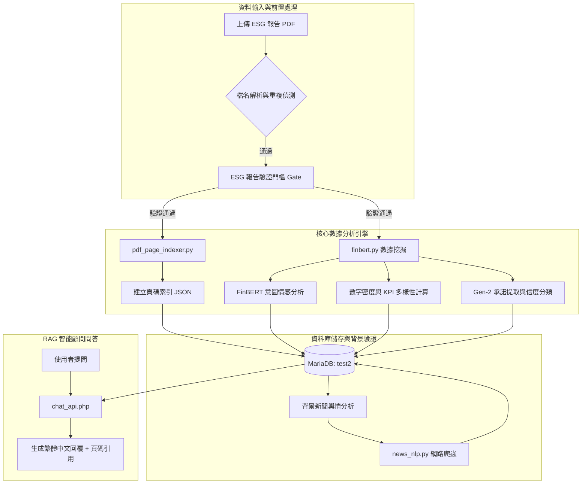

# EcoTrust AI (eco_trust)

> **EcoTrust AI** 是一個結合金融財務指標與綠色永續指標的雙引擎企業永續評估平台，旨在克服傳統評估容易面臨的永續與財務積效脫勾問題，去碳排化地評估企業永續報告的數據實質性與誠信度。https://www.youtube.com/watch?v=OL6EPG0amjQ

---

## 🌟 核心特色

- **去碳排化評估**：不單看企業申報的碳排數據，而是以 FinBERT 分析申報文本的誠信度與數據實質性。
- **承諾生命週期驗證 (Gen-2)**：自動提取企業在報告書中的高信度承諾（具備明確時限與量化數值），並透過 Google News RSS 背景檢索外部輿情進行交叉驗證。
- **頁碼感知 RAG 智能顧問**：結合非對稱式頁碼檢索與 MariaDB 結構化指標數據，透過 Ollama (Qwen2.5) 提供具備精確頁碼引用 `[p.X]` 與 `[資料庫]` 來源標記的問答，防範 LLM 幻覺。

---

## 🛠️ 系統架構



---

## 🗄️ 資料庫設計 (MariaDB: `test2`)

- `companies`: 公司基本資料（股票代號、名稱、產業）
- `company_performance`: 歷年財務業績（ROE 數據）
- `carbon_emissions`: 經 FinBERT 與演算法分析後的誠信信心得分與承諾細節
- `news`: 外部 ESG 輿情新聞與情感分析標記

---

## 🚀 專案結構與程式碼模組

| 檔案路徑 | 負責技術 / 邏輯模組 |
| :--- | :--- |
| [`api/upload_pdf.php`](file:///c:/xampp/htdocs/eco_sys/api/upload_pdf.php) | PDF上傳、檔名智能解析、資料庫更新、觸發背景新聞爬蟲 |
| [`finbert.py`](file:///c:/xampp/htdocs/eco_sys/finbert.py) | ESG關鍵字Gate、智慧切片、FinBERT情感推理、數據密度與KPI計分、Gen-2承諾提取 |
| [`pdf_page_indexer.py`](file:///c:/xampp/htdocs/eco_sys/pdf_page_indexer.py) | PDF 頁碼解構，產出頁碼文本對照索引 JSON |
| [`api/chat_api.php`](file:///c:/xampp/htdocs/eco_sys/api/chat_api.php) | RAG 檢索邏輯、N-gram分詞、多源 Facts 融合、對接 Ollama 完成問答推理 |
| [`news_nlp.py`](file:///c:/xampp/htdocs/eco_sys/news_nlp.py) | Google News RSS 輿情新聞爬取、承諾關鍵字自適應提取、情感分析評級 |
| [`config.php`](file:///c:/xampp/htdocs/eco_sys/config.php) | 資料庫連線配置 |

---

## ⚙️ 安裝與環境設定

1. **資料庫設定**：導入 `migrate_gen2.sql` 或 `test2.sql` 至本地 MariaDB 中，資料庫名稱設定為 `test2`。
2. **PHP 伺服器**：將本專案放入 XAMPP 的 `htdocs/eco_sys` 目錄下。
3. **Python 依賴套件**：
   ```bash
   pip install -r requirements.txt
   ```
   *(需包含 `transformers`, `torch`, `jieba`, `pdfplumber`, `beautifulsoup4`, `feedparser` 等)*
4. **FinBERT 模型**：請下載 `yiyanghkust/finbert-tone-chinese` 模型並放置於 `finbert_model` 目錄下。
