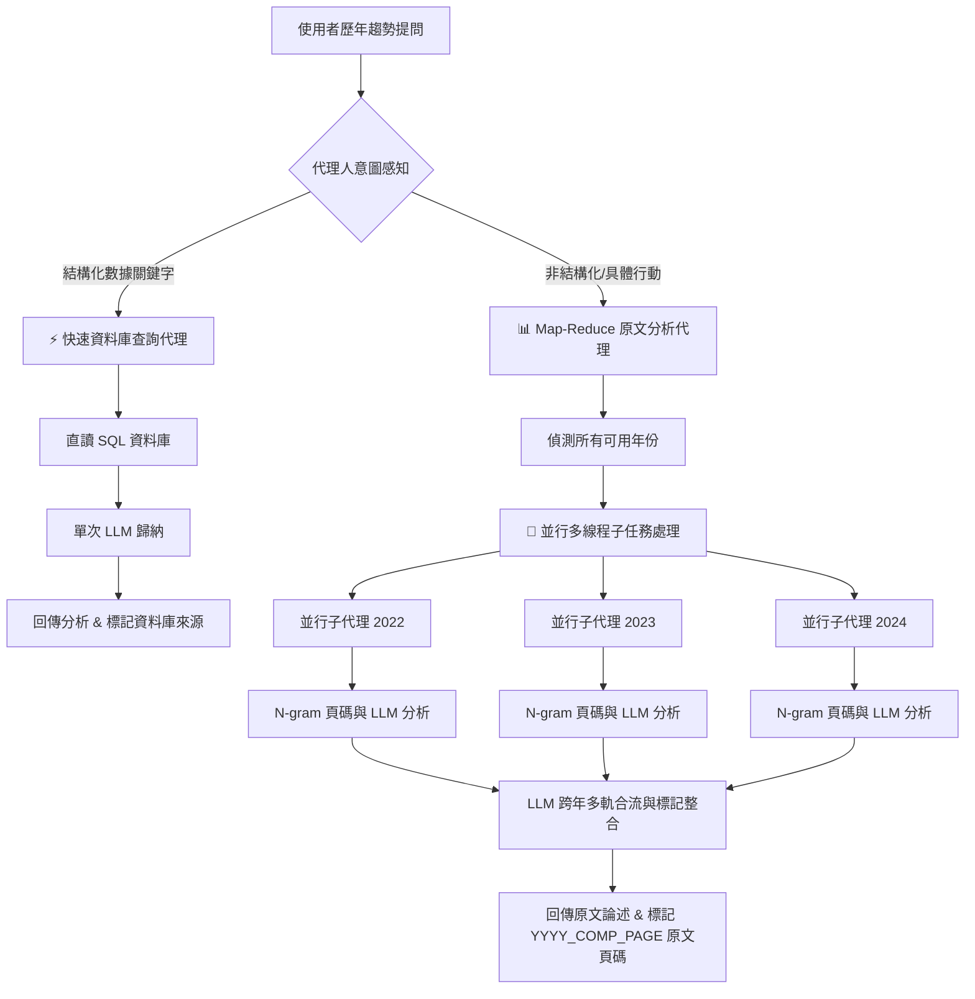

# Eco Trust AI Agent — 專用展示技能手冊 (Demo Skills Playbook)

本手冊旨在引導展示者（Presenter）如何在 Demo 現場完美呈現 **Eco Trust AI Agent** 的三大核心代理人（Agentic）能力。對話介面中輸入框正上方已配備三個 Demo 專用快速按鈕，點擊即可一鍵測試。

---

## 🤖 核心代理人架構說明

在進行歷年趨勢（多年份）分析時，AI Agent 具備**「意圖感知」**與**「動態路由（Dynamic Routing）」**能力，能根據問題屬性自動切換最合適的執行策略：

---

## ⚡ 現場展示三大 Demo 技能場景

展示時，請先至左上角選擇一間公司（如 **1103_嘉泥** 或 **1101_台泥**），並選擇年份為 **📈 歷年趨勢 (多年份)**。接著點擊輸入框上方對應按鈕：

### 1. 📊 快速財務資料庫 (ROE 變化) — 快速查核技能
*   **點擊觸發問題**：`該公司近年來的 ROE 發生了什麼變化？`
*   **背後 Agent 行動**：
    *   `[Agent Brain]` 識別問題屬於**結構化量化指標**，不需拆解厚重的 PDF 全文。
    *   `[Agent Tool]` 直連 MariaDB，高速讀取 `company_performance` 表中歷年的每季 ROE。
    *   `[Agent Done]` 以極速（約 3~5 秒內）生成跨年度季度趨勢報告，並於事實句尾標註 `[資料庫]`。
*   **現場講解重點**：
    *   強調 Agent 的**高效率與低資源消耗**。以往傳統 LLM 需要去翻閱 4、5 年總共數百頁的報告書，速度慢且容易遺漏；而我們的 Agent 能識別指標直接讀取資料庫，兼顧速度與 100% 精確度。

---

### 2. 📑 報告具體行動 (綜合整理 ROE、減碳與輿情) — 混合檢索與定位技能
*   **點擊觸發問題**：`請幫我綜合整理公司近年來的財務 ROE 表現、報告書中提到的具體減碳行動與措施，以及近年相關的新聞輿情事件。`
*   **背後 Agent 行動**：
    *   `[Agent Brain]` 識別問題屬於**非結構化與結構化的混合任務**，需要翻閱 PDF 文本並整合資料庫的數據與新聞。
    *   `[Agent Tool]` 自動獲取該公司所有上傳的歷史 PDF 年份，並**非同步並行啟動多個子代理任務 (Promise.all)**。
    *   `[Agent Tool]` 一邊並行從資料庫檢索 ROE 數據與新聞輿情，一邊並行使用分詞打分匹配 PDF 原文頁面。
    *   `[Agent Done]` 最終合流代理人（Synthesizer）將三者深度融合，在同一個答覆中同時呈現 `[資料庫]` 量化標籤、藍色 `[新聞]` 連結膠囊、以及可直接跳轉 PDF 的 `[p.頁碼]` 原文頁碼標籤。
*   **現場講解重點**：
    *   請向觀眾展示本系統的**多源資料整合與溯源能力**：在同一個回答中，系統既能將結構化財務指標標記為 `[資料庫]`，將輿情標記為帶有真實連結的 `[新聞]`，又能精確提取 PDF 頁碼（如 `[p.12_2023]`）。點擊頁碼即可立刻載入該年報告並跳轉至該頁，完美演示了跨數據源合流與防幻覺查核機制。
    *   強調 **並行多線程處理能力**：系統會並行發送所有年度的分析請求（而非一個一個序列等待），大幅提升模型推理的總體吞吐量與流暢度，縮減 3 倍的等待時間。

---

### 3. 🧠 抽象策略評估 (展示思考過程) — 深度推論技能
*   **點擊觸發問題**：`綜合評估該公司在永續治理與環境策略上的整體表現與挑戰為何？`
*   **背後 Agent 行動**：
    *   `[Agent Brain]` 識別此為**開放式高階策略提問**，涉及財務硬指標、ESG 信賴得分與輿情新聞的多維度交叉推理。
    *   `[Agent Tool]` 啟動 Map-Reduce 架構，整合各年度財務（ROE）、誠信信心分數（Promises/Rates）與外部新聞數據。
    *   `[Agent Tool]` 在進度載入中，即時將 Agent 內部的思考邏輯與調用鏈（如分析屬性、載入特徵、相關度打分）輸出至 **「Agent Console 終端機」**，讓思考過程可視化。
    *   `[Agent Done]` 生成結合財務與 ESG 互補性（如：ROE 雖然波動，但 ESG 承諾可靠性與信心分數逐年上升等）的客觀批判性評估報告。
*   **現場講解重點**：
    *   引導觀眾注視對話框中的**綠色 Agent 終端機控制台（Agent Console Log）**，向觀眾解釋 Agent 目前正在進行哪些工具調用、大腦思考與子任務處理。這能強烈凸顯系統並非單純的關鍵字匹配，而是具有完整計畫與執行能力的自主代理人。
